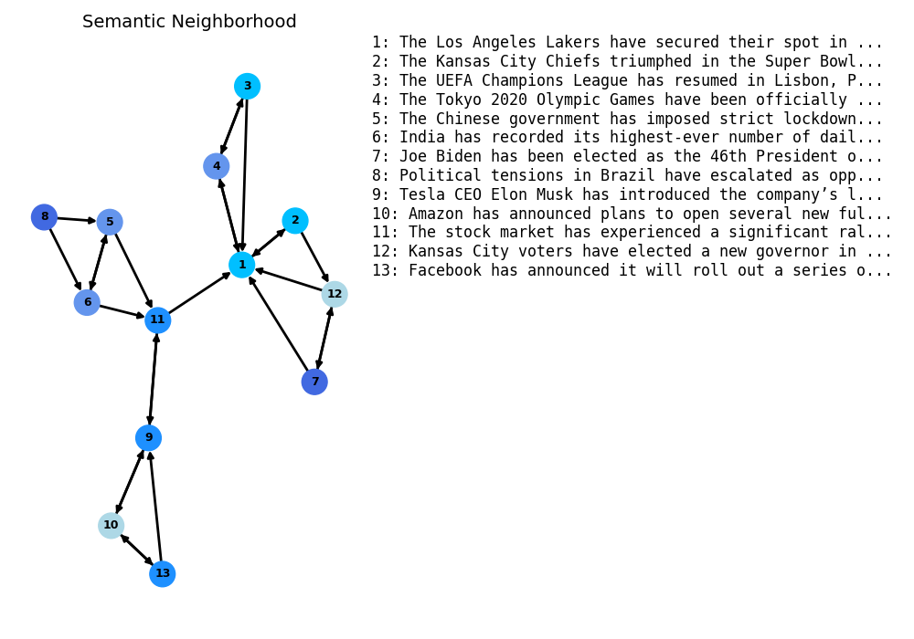
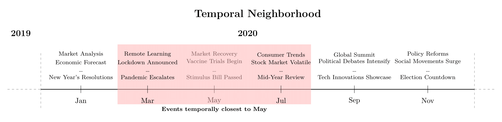
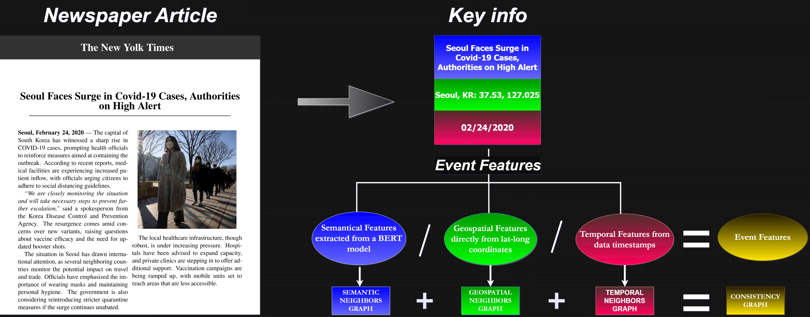

# RL-COVID-Events  

This repository provides the necessary code and resources for conducting experiments that evaluate **neighborhood topological preservation** in widely used **dimensionality reduction techniques** applied to **event-related COVID-19 data**.  

## Overview  

This project processes a dataset of **COVID-19-related news articles**, where each article describes an event. Every event in the dataset includes the following key components:  

- **Text Content:** The news article's **headline**, which serves as a textual summary of the event.  
- **Geographical Coordinates:** The **latitude and longitude** of the location where the event occurred or was reported.  
- **Timestamps:** The **date** associated with the reported event.  

To analyze this dataset, we sample groups of events based on predefined **labels**. For each sampled event, which will became itself an usage dataset, we extract and transform its attributes into numerical *event features* for further processing:  

- **Semantic Features:** The news headlines are converted into **768-dimensional embeddings** using a **pre-trained BERT model**. These embeddings capture the semantic meaning of the text.  
- **Geospatial Features:** The event's **latitude and longitude** are used as raw geographical coordinates to represent spatial positioning.  
- **Temporal Features:** The **event timestamps** are extracted and converted into a numerical format that preserves temporal relationships.  

Concatenating these features, we construct an **initial raw feature vector** for each event. Additionally, we generate three separate **nearest-neighbor graphs**, each emphasizing a different type of relationship:  

- **Semantic Similarity Graph:** Connects events with similar textual meanings based on their BERT embeddings.  
- **Geospatial Proximity Graph:** Connects events that occurred near each other geographically.  
- **Temporal Closeness Graph:** Connects events that happened within a close time frame.  


<div style="display: flex; justify-content: center; gap: 8px;">
    
    
</div>

<div style="display: flex; justify-content: center; gap: 10px; margin-top: 20px;">
    
</div>

Finally, we construct a **reference consistency graph** by summing the adjacency matrices of the three graphs and applying a threshold to the resulting values. An edge is established between two nodes if their summed value meets or exceeds this threshold, meaning that such edge exists at least in *threshold* of the three graphs. This final structure serves as a foundation for evaluating how effectively various dimensionality reduction techniques preserve local neighborhood structures in high-dimensional event-related data.

<div style="display: flex; justify-content: center; gap: 10px; margin-top: 20px;">
    
</div>

## Methodology

Dimensionality reduction techniques —**PCA**, **PCA + t-SNE**, **t-SNE**, and **UMAP**— are applied to the multidimensional raw feature vector (concatenating the embeddings, coordinates, and timestamps). The resulting lower-dimensional feature vectors are used to generate a new neighborhood graph, which is compared to all reference graphs to evaluate preservation quality.

The comparison considers the edges of each graph by computing:
- **Precision:** Proportion of generated edges that are correct, accordingly to the reference graph compared.
- **Recall:** Proportion of reference edges that were correctly generated.
- **F1-score:** The harmonic mean of **Precision** and **Recall**.


## Hyperparameters

The experiments varies several hyperparameters, including:
- Number of neighbors in the semantic, geospatial, and temporal neighbors graphs.
- Number of neighbors in the PCA-, t-SNE-, and UMAP-reduced neighbors graphs.
- PCA `whitened` parameter.
- t-SNE and UMAP initialization (PCA or Spectral).
- t-SNE perplexity.
- UMAP parameters: `n_neighbors` and `min_dist`.

## Evaluation

Each combination of hyperameter generates a different graph. So, each technique and the consistency itself has many generated graphs to be compared. Each graph generated by a technique is compared to every consistency graph. Critical Difference Diagrams are generated to determine which dimensionality reduction method produces the most accurate feature vector compared to the reference consistency graph, for each usage dataset.

# Technical Details

## Event Analysis
Event Analysis is a research area focused on understanding events and their interconnections. An event is defined as something that happens—with a description (what), a cause (why), at a location (where), at a specific time (when), by an agent (who), and in a particular manner (how). In short, an event is an action or series of actions, or a change that occurs due to specific reasons, involving entities such as objects, humans, and locations.

For example, researchers at the National Institute for Space Research discovered that fires in the Amazon Rainforest increased by 30% in 2019 using environmental data analysis techniques. This example illustrates how different dimensions of an event (who, what, when, where, how) are essential for a complete understanding:
- **Who:** Researchers at the National Institute for Space Research.
- **What:** Discovered that fires increased by 30%.
- **When:** In 2019.
- **Where:** In the Amazon Rainforest.
- **How:** Using environmental data analysis techniques.

Many applications are data-driven, and machine learning offers powerful tools to analyze events. However, because events are multi-dimensional—encompassing semantic, spatial, and temporal components—the challenge becomes: **How can events be modeled for machine learning while respecting these constraints?**

## Representation Learning
Representation Learning is a foundational area in modern machine learning. The seminal paper, ["Representation Learning: A Review and New Perspectives" by Bengio, Courville, and Vincent](https://arxiv.org/pdf/1206.5538), outlines key attributes of effective representations, such as smoothness, multiple explanatory factors, hierarchical organization, semi-supervised learning, shared factors across tasks, manifolds, natural clustering, temporal and spatial coherence, and simplicity in dependencies.

Building on these concepts, event analysis requires representations that incorporate additional constraints:
- The new feature space must be low-dimensional to facilitate human analysis, explanation, and interpretation of downstream machine learning decisions.
- The new space should preserve, as much as possible, the original semantic, geospatial, and temporal proximities. Events with close description, geographical coordinates and dates must remain close in the new space.

# Purpose
This repository aims to evaluate whether tecniques like PCA, t-SNE, and UMAP can generate representations that faithfully preserve the original multi-dimensional proximities of event data. By leveraging consistency graphs —constructed from independently generated nearest-neighbor graphs for semantic, geospatial, and temporal features— we can assess how well these dimensionality reduction methods maintain the inherent structure of the data.

If they perform well in that task, the new feature space is low-dimensional and maintain the original proximities, besides the fact they may be the main simple options for dimensionality reduction. If not, there's a path explore modern representation learning techniques.

# How to run
All experimental steps are orchestrated via the `run_experiments.sh` script. To generate every result, without anyelse work, simply execute the following command in your terminal:

```bash
./run_experiments.sh
```
Before running the experiments, please ensure you have installed all necessary dependencies by reviewing the environment.yml or requirements.txt files. We highly recommend you to do so.

**Note**: In future versions, run_experiments.sh will be replaced by a main.py script to improve cross-platform compatibility.

## Execution Workflow

The workflow that run_experiments.sh employs is equivalent to the following steps:

- Data Preparation:

Navigate to the DataPreparation folder.
Open pre_processing_dataset.ipynb to process the original dataset and generate sampled datasets, which will be stored in the UsageDatasets folder.

- Feature Extraction:

For each dataset, run event_features.py to extract event features.
The extracted features will be saved in the DatasetEventFeatures folder.

- Graph Generation:

Generate the reference nearest-neighbor graphs in the GraphEvaluation folder using consistency_main.py.
Apply dimensionality reduction (via PCA, t-SNE, and UMAP) in the GraphGeneration folder by running pca_main.py, tsne_main.py, and umap_main.py.
The generated graphs will be saved in the GeneratedGraphs folder.

- Evaluation:

Return to the GraphEvaluation folder and execute evaluation_main.py to calculate precision and recall by comparing each reduced graph with the reference consistency graph. Note this part can take a while, depending on how many graphs were generated.
Finally, run the critdd_template to generate an analysis notebook that includes a critical difference diagram showing the best-performing technique.
The results for each dataset will be stored in the CritddResults folder.

- Side Notes:
1. Review the run_experiments.sh script to configure the optimal hardware parameters (e.g., n_jobs, parallel execution, etc.) based on your system.
2. Please note, this process may take some time. The results were generated using a highly up-to-date and powerful computer.
3. The work is meant to be general-event-purpose; We are using COVID as background just to exemplify the methodology.
# How to contribute
