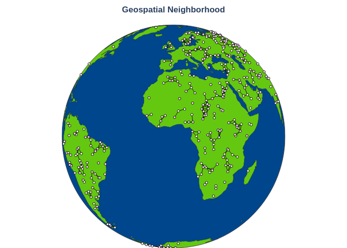

# RL-COVID-Events  

This repository provides the necessary code and resources for conducting experiments that evaluate **neighborhood topological preservation** in widely used literature **dimensionality reduction techniques** applied to **event-related COVID-19 data**. The main goal is determine wether or not such tecniques are useful for event analysis' representation learning.

## Overview  

This project processes a dataset of **COVID-19-related news articles**, where each article describes an event. Every event in the dataset includes the following key components:  

- **Text Component:** The news article's **headline**, which serves as a textual summary of the event.  
- **Geographical Component:** The **latitude and longitude** of the location where the event occurred or was reported.  
- **Temporal Component:** The **date** associated with the reported event.  

To analyze these data, we make samples of events based on predefined **labels**. For each sample, which will became itself an usage dataset, we extract and transform its attributes into numerical *event features* for further processing:  

- **Semantic Features:** The news headlines are converted into **768-dimensional embeddings** using a **pre-trained BERT model**. These embeddings capture the semantic meaning of the text.  
- **Geospatial Features:** The event's **latitude and longitude** are used as raw geographical coordinates to represent spatial positioning.  
- **Temporal Features:** The **event timestamps** are extracted and converted into a numerical format that preserves temporal relationships.  

From each of these three kinds of features individually, we generate **nearest-neighbor graphs**, emphasizing a different type of relationship:  

- **Semantic Similarity Graph:** Connects events with most similar textual meanings based on their BERT embeddings.  
- **Geospatial Proximity Graph:** Connects events that occurred neareast to each other geographically.  
- **Temporal Closeness Graph:** Connects events that happened within the closest time frame.  


<div style="text-align: center; margin-bottom: 20px;">
    
    
</div>

<div style="text-align: center; margin-bottom: 20px;">
    
</div>

<p style="text-align: left; margin-bottom: 20px;">
    We then construct a <strong>reference consistency graph</strong> by summing the adjacency matrices of the three graphs and applying a threshold to the resulting values. An edge is established between two nodes if their summed value meets or exceeds this threshold, meaning that such edge exists at least in <em>threshold</em> of the three graphs. This final structure serves as a foundation for evaluating how effectively various dimensionality reduction techniques preserve local neighborhood structures in high-dimensional event-related data.
</p>

We also concatenate these three kinds of features, constructing an **initial raw feature vector** for each event. This  **raw feature vector** is what will be passed for the dimensionality reduction tecniques, which will create embeddings/representations in low dimension for the events.

<div style="text-align: center; margin-bottom: 20px;">
    
</div>

## Methodology

Dimensionality reduction techniques are applied to the multidimensional raw feature vector. The repository explores the following techniques:

- **ICA**
- **Isomap**
- **Locally Linear Embeddings (LLE)**
- **PCA**
- **Gaussian Random Projection**
- **Laplacian Eigenmaps**
- **t-SNE**
- **UMAP**

These methods were selected because they are well-established in the literature and offer computational efficiency. Other techniques were tested but ultimately excluded for various reasons:

* Usage Restrictions: For example, NMF decomposition requires strictly positive data, which cannot be assumed in this context.

* Instability: Implementations of diffusion maps did not converge reliably in experiments.

* High Computational Cost: Methods such as Kernel PCA and MDS proved too computationally intensive.

Future work will focus on exploring more advanced techniques, including autoencoders, variational autoencoders, parametric UMAP, supervised UMAP, Dense UMAP, parametric t-SNE, and PacMap. Feedback on additional promising methods is welcome.

The methodology involves:
1. **Reduction:** Converting the high-dimensional raw features into a lower-dimensional space using the aforementioned techniques.
2. **Graph Generation:** Constructing a new neighborhood graph based on the reduced features.
3. **Comparison:** Evaluating the quality of the neighborhood preservation by comparing the generated graph with reference consistency graphs using the following metrics:
   - **Precision:** Amount of generated edges that are correct (according to the reference graph), over all generated edges.
   - **Recall:** Amount of reference edges that are correctly generated, over the amount edges in reference graph.
   - **F1-score:** The harmonic mean of precision and recall.

## Hyperparameters

The experiments vary several hyperparameters across both the reference graphs and the dimensionality reduction techniques. Key hyperparameters include:

### Reference Graphs
- **Number of neighbors:**
  - Semantic (`k_s`)
  - Geospatial (`k_g`)
  - Temporal (`k_t`)

### Dimensionality-Reduced Graphs
- **Number of neighbors:** Specific parameters (e.g., `k_ica`, `k_isomap`, etc.) for each technique.

### Technique-Specific Hyperparameters
- **ICA:**
  - Whitening strategy (`whiten`)
  - Functional form (`fun`) for approximating neg-entropy.
- **Isomap:**
  - Number of neighbors (`n_neighbors`) to consider for each point, when attempting to learn the manifold structure.
- **Locally Linear Embeddings (LLE):**
  - Number of neighbors (`n_neighbors`)
  - Algorithm/method (`method`)
- **PCA:**
  - Whitening option (`whiten`), which ensures outputs with unit component-wise variances.
- **Laplacian Eigenmaps:**
  - Number of neighbors (`n_neighbors`)
- **t-SNE and UMAP:**
  - Initialization (`PCA` or `Spectral`)
  - Metric (`euclidean` or `cosine`)
- **t-SNE:**
  - Perplexity (`perplexity`)
- **UMAP:**
  - Number of neighbors (`n_neighbors`)
  - Minimum distance (`min_dist`) between points in the lower-dimensional representation.

## Evaluation

Each combination of hyperparameters might produce a different graph. Therefore, each technique and consistency setting generate multiple graphs that need to be compared. Every graph produced by a technique is compared to each consistency graph. To evaluate a technique's performance for a given consistency graph, we take the mean of the top 20% of the technique's generated graphs for this consistency graph. Critical Difference Diagrams are then used to analyze performance across the consistency graphs, helping to identify which dimensionality reduction method produces the most accurate feature vectors for each usage dataset.

# Technical Details

## Event Analysis

Event Analysis is a research area focused on understanding events and their interconnections. An event is defined as something that happens—with a description (what), a cause (why), at a location (where), at a specific time (when), by an agent (who), and in a particular manner (how). In short, an event is an action or series of actions, or a change that occurs due to specific reasons, involving entities such as objects, humans, and locations.

An event example can be as follows: _Researchers at the National Institute for Space Research discovered that fires in the Amazon Rainforest increased by 30% in 2019 using environmental data analysis_. We shall break this event in the previous components: 
- **Who:** Researchers at the National Institute for Space Research.
- **What:** Discovered that fires increased by 30%.
- **When:** In 2019.
- **Where:** In the Amazon Rainforest.
- **How:** Using environmental data analysis.

Many applications are data-driven, and machine learning offers powerful tools to analyze events. However, because events are multi-dimensional, encompassing semantic, spatial, and temporal components, the challenge becomes: **How can events be modeled for machine learning while preserving these components?**

## Representation Learning
Representation Learning is a foundational area in modern machine learning. The seminal paper, ["Representation Learning: A Review and New Perspectives" by Bengio, Courville, and Vincent](https://arxiv.org/pdf/1206.5538), outlines key attributes of effective representations, such as smoothness, multiple explanatory factors, hierarchical organization, semi-supervised learning, shared factors across tasks, manifolds, natural clustering, temporal and spatial coherence, and simplicity in dependencies.

Building on these concepts, event analysis requires representations that incorporate additional constraints:
- The new feature space must be low-dimensional to facilitate human analysis, explanation, and interpretation of downstream machine learning decisions.
- The new space should preserve, as much as possible, the original semantic, geospatial, and temporal proximities. Events with close description, geographical coordinates and dates must remain close in the new space.

These constraints arise because, unlike in other machine learning applications, understanding decisions and the initial relationships between events is paramount to event analysis.

# Purpose

This repository aims to evaluate whether tecniques like PCA, t-SNE, and UMAP can generate representations that faithfully preserve the original multi-dimensional proximities of event data. By leveraging consistency graphs —constructed from independently generated nearest-neighbor graphs for semantic, geospatial, and temporal features— we can assess how well these dimensionality reduction methods maintain the inherent structure of the data.

If they perform well in that task, the new feature space is low-dimensional and maintain the original proximities, besides the fact they may be the main simple options for dimensionality reduction. If not, there's a path explore modern representation learning techniques.

# How to run

All experimental steps are orchestrated via the `run_experiments.sh` script. After setting up the environment and hardware configs, to generate every result, without anyelse work, simply execute the following command in your terminal:

```bash
./run_experiments.sh
```
Before running the experiments, please ensure you have installed all necessary dependencies by reviewing the environment.yml or requirements.txt files. We highly recommend you to do so.

**Note**: In future versions, run_experiments.sh may be replaced by a main.py script to improve cross-platform compatibility. Using bash was more related to the ease of parallel programming.

## Execution Workflow

The workflow that run_experiments.sh employs is equivalent to the following steps:

- Data Preparation:

Navigate to the DataPreparation folder.
Open pre_processing_dataset.ipynb to process the original dataset and generate sampled datasets, which will be stored in the UsageDatasets folder.

- Feature Extraction:

For each dataset, run event_features.py to extract event features.
The extracted features will be saved in the DatasetEventFeatures folder.

- Graph Generation:

Generate the reference nearest-neighbor graphs in the GraphEvaluation folder using consistency_main.py.
Apply dimensionality reduction in the GraphGeneration folder by running pca_main.py, tsne_main.py, umap_main.py, etc.
The generated graphs will be saved in the GeneratedGraphs folder.

- Evaluation:

Return to the GraphEvaluation folder and execute evaluation_main.py to calculate precision and recall by comparing each reduced graph with the reference consistency graph. Note this part can take a while, depending on how many graphs were generated.
Finally, run the critdd_template to generate an analysis notebook that includes a critical difference diagram showing the best-performing technique.
The results for each dataset will be stored in the CritddResults folder.

- Side Notes:
1. Review the `run_experiments.sh` script and `/Lib` directory to configure the optimal hardware parameters (e.g., n_jobs, parallel execution, etc.) based on your system. Always keep in mind the number of CPU cores you have avaible.
2. You can also adapt the prospect files and dir that will be created easily by passing parameters and by configure the `run_experiments.sh`.
2. Please note, this process may take some time. The results were generated using a highly up-to-date and powerful computer.
3. The work is meant to be general-event-purpose; We are using COVID as background just to exemplify the methodology.

# How to contribute
